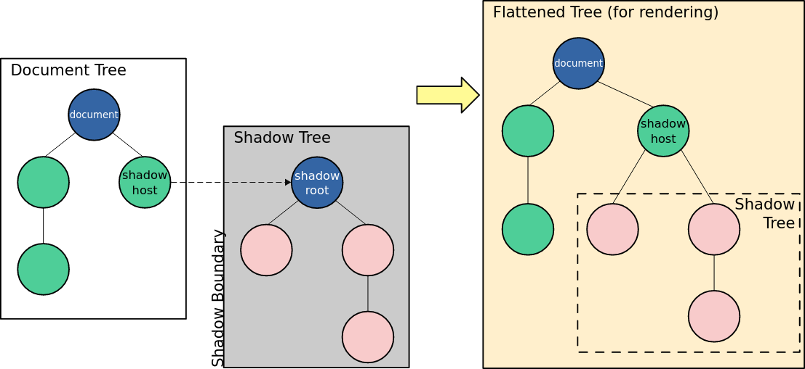

# Using shadow DOM

We can use a shadow DOM to attach a DOM tree to our custom element. This allows us to hide the internals of this tree from JavaScript and CSS running in the page.

## High-level view

Shadow DOM allows hidden DOM trees to be attached to elements in the regular DOM tree. The shadow DOM starts with a shadow root, underneath which we can attach any element, just like the normal DOM.



Here is some shadow DOM terminology:

- **Shadow host**: The regular DOM node that the shadow DOM is attached to.
- **Shadow tree**: The DOM tree inside the shadow DOM.
- **Shadow boundary**: The place where the shadow DOM ends, and the regular DOM begins.
- **Shadow root**: The root node of the shadow tree.

We can treat nodes in the shadow DOM as we would non-shadow nodes. The difference is that none of the code inside the shadow DOM can affect anything outside it.

The shadow DOM specification enables us to manipulate the shadow DOM or our custom elements.

## Creating a shadow DOM

```html
<div id="host"></div>
<span>I'm not in the shadow DOM</span>
```

We are using the "host" element as the shadow host. We can call ```attachShadow``` on the host to create the shadow DOM, and can then add nodes to the shadow DOM.

```js
const host = document.querySelector('host')
const shadow = host.attachShadow({ mode: 'open' })
const span = document.createElement('span')
span.textContent = `I'm in the shadow DOM`
shadow.appendChild(span)
```

## Encapsulation from JavaScript

```html
<div id="host"></div>
<span>I'm not in the shadow DOM</span>
<br />

<button id="upper" type="button">Uppercase span elements</button>
<button id="reload" type="button">Reload</button>
```

```js
const host = document.querySelector("#host");
const shadow = host.attachShadow({ mode: "open" });
const span = document.createElement("span");
span.textContent = "I'm in the shadow DOM";
shadow.appendChild(span);

const upper = document.querySelector("button#upper");
upper.addEventListener("click", () => {
  const spans = Array.from(document.querySelectorAll("span"));
  for (const span of spans) {
    span.textContent = span.textContent.toUpperCase();
  }
});

const reload = document.querySelector("#reload");
reload.addEventListener("click", () => document.location.reload());
```

When we run the above code, we see that the ```querySelectorAll()``` does not find the elements in our shadow DOM.

## Element.shadowRoot and the "mode" option

When our ```attachShadow``` method is passed the argument ```{ mode: open }```, the JavaScript in the page is able to access our shadow DOM through the ```shadowRoot``` property of the shadow host.

```html
<div id="host"></div>
<span>I'm not in the shadow DOM</span>
<br />

<button id="upper" type="button">Uppercase shadow DOM span elements</button>
<button id="reload" type="button">Reload</button>
```

```js
const host = document.querySelector("#host");
const shadow = host.attachShadow({ mode: "open" });
const span = document.createElement("span");
span.textContent = "I'm in the shadow DOM";
shadow.appendChild(span);

const upper = document.querySelector("button#upper");
upper.addEventListener("click", () => {
  const spans = Array.from(host.shadowRoot.querySelectorAll("span"));
  for (const span of spans) {
    span.textContent = span.textContent.toUpperCase();
  }
});

const reload = document.querySelector("#reload");
reload.addEventListener("click", () => document.location.reload());
```

The above code is the same as the previous example, except that we are selecting the ```host``` in our search for ```span``` elements. Now we are only selecting from elements within our shadow host, not the original DOM.

If we were to set ```{ mode: closed }```, then the encapsulation of our shadow host cannot be accessed by the page. The ```shadowRoot``` returns ```null```.

There are still ways to bypass a *closed* shadowRoot, so this is more of a way to indicate that our shadow DOM tree *should* not be accessed by the page.

## Encapsulation from CSS

### Example

Our HTML:

```html
<div id="host"></div>
<span>I'm not in the shadow DOM</span>
```

Our JavaScript, create our shadow DOM:

```js
const host = document.querySelector("#host");
const shadow = host.attachShadow({ mode: "open" });
const span = document.createElement("span");
span.textContent = "I'm in the shadow DOM";
shadow.appendChild(span);
```

Our CSS:

```css
span {
  color: blue;
  border: 1px solid black;
}
```

The CSS does not affect nodes inside the shadow DOM.

## Applying styles inside the shadow DOM

Here are two ways to apply styles inside the shadow DOM tree:

- **Programmatically** - Construct a **CSSStyleSheet** object and attach it to the shadow root.
- **Declaratively** - Add a ```<style>``` element in a ```<template>``` element's declaration.

In both cases, the syles are scoped to the shadow DOM tree. 

### Constructable stylesheets

Here are the steps to style elements in the shadow DOM using constructable stylesheets:

1. Create an empty ```CSSStyleSheet``` object.
2. Set its content using ```CSSStyleSheet.replace()``` or ```CSSStyleSheet.replaceSync()```.
3. Add it to the shadow root by assigning it to ```ShadowRoot.adoptedStyleSheets```.

Rules in the ```CSSStyleSheet``` will be scoped to the shadow DOM tree, as well as any other DOM trees to which we have assigned it.

Here is our HTML containing our host and a ```<span>```:

```html
<div id="host"></div>
<span>I'm not in the shadow DOM</span>
```

In our JavaScript we will create the shadow DOM and assign a ```CSSStyleSheet``` object to it:

```js
const sheet = new CSSStyleSheet();
sheet.replaceSync("span { color: red; border: 2px dotted black;}");

const host = document.querySelector("#host");

const shadow = host.attachShadow({ mode: "open" });
shadow.adoptedStyleSheets = [sheet];

const span = document.createElement("span");
span.textContent = "I'm in the shadow DOM";
shadow.appendChild(span);
```

### Adding ```<style>``` elements in ```<template>``` declarations

We can include a ```<style>``` element inside the ```<template>``` element use to define a web component.

Our HTML includes a ```<template>``` declaration:

```html
<template id="my-element">
  <style>
    span {
      color: red;
      border: 2px dotted black;
    }
  </style>
  <span>I'm in the shadow DOM</span>
</template>

<div id="host"></div>
<span>I'm not in the shadow DOM</span>
```

In our JavaScript, we create the shadow DOM and add the content of the ```<template>``` to it:

```js
const host = document.querySelector("#host");
const shadow = host.attachShadow({ mode: "open" });
const template = document.getElementById("my-element");

shadow.appendChild(template.content);
```

### Choosing between programmatic and declarative options

Which option we choose depends on our application and personal preference.

Creating a CSSStyleSheet and assigning it to the shadow root using adoptedStyleSheets allows you to create a single stylesheet and share it among many DOM trees. For example, a component library could create a single stylesheet and then share it among all the custom elements belonging to that library. The browser will parse that stylesheet once. Also, you can make dynamic changes to the stylesheet and have them propagate to all components that use the sheet.

The approach of attaching a ```<style>``` element is great if you want to be declarative, have few styles, and don't need to share styles across different components.

## Shadow DOM and custom elements

Shadow DOM allows us to encapsulate our custom elements.

Custom elements are implemented as a class which extends either the base ```<HTMLElement``` or a built-in HTML element such as ```HTMLParagraphElement```. Typically, the custom element itself is a shadow host, and the element creates multiple elements under the root, to provide internal implementation of the element.

The example below creates a ```<filled-circle>``` custom element that just renders a circle filled with a solid color.

```js
class FilledCircle extends HTMLElement {
  constructor() {
    super();
  }
  connectedCallback() {
    // Create a shadow root
    // The custom element itself is the shadow host
    const shadow = this.attachShadow({ mode: "open" });

    // create the internal implementation
    const svg = document.createElementNS("http://www.w3.org/2000/svg", "svg");
    const circle = document.createElementNS(
      "http://www.w3.org/2000/svg",
      "circle",
    );
    circle.setAttribute("cx", "50");
    circle.setAttribute("cy", "50");
    circle.setAttribute("r", "50");
    circle.setAttribute("fill", this.getAttribute("color"));
    svg.appendChild(circle);

    shadow.appendChild(svg);
  }
}

customElements.define("filled-circle", FilledCircle);
```

```html
<filled-circle color="blue"></filled-circle>
```